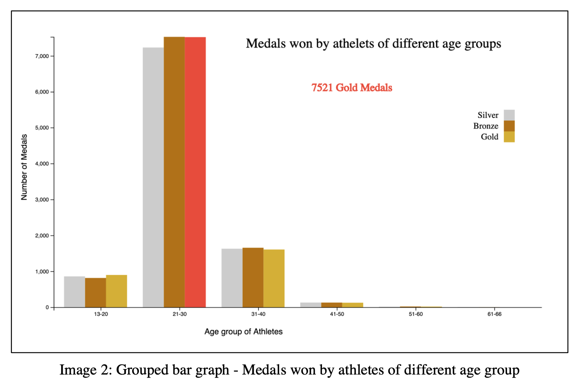

# Visualisation_athlete_events_d3.js

### Dataset
###### The chosen dataset was the historical dataset of modern Olympic Games of 120 years (from Athens 1896 to Rio 2016). The dataset has total 15 attributes, named id, age, height, weight, year as numerical attributes and name, sex, team, NOC, games, city (hosted city), sports, events as categorical attributes. The target attribute is ‘Medals’. The dataset has 271116 observations. Each observation represents the athlete’s record of playing in the Olympic Games.

[Link to dataset](https://www.kaggle.com/heesoo37/120-years-of-olympic-history-athletes-and-results)

### Grouped bar Graph
###### The grouped bar graph shows the information about the number of athletes who won medals in Olympics games. The graph has grouped the data by the different age groups to get the aerial view of athletes' age and medals.
###### The attributes ‘ageGroup’ and ‘medals’ as categorical (Gold/Silver/Bronze) and also as numerical (calculating the count) have been used. The X axis has the 3 bars (Gold/Silver/Bronze) per age group. The Y axis represents the number of medals.
###### As seen in the below image , Each bar has a hover effect to show the tooltip, the selected bar (with red color) can be read as that ‘7521 gold medals have been won by 21-30 years old athletes’.

  

### Bar Graph
###### The bar graph shows the cities (Hosting cities of games) and the number of times it was being hosted in those cities. The Graph uses the ‘city’ as a category and as numerical to calculate the count of cities. The X axis represents the name of city and Y axis shows the count of cities.
###### The selected bar (red color one) in the below image, the tooltip with displayed and it can be read as ‘The Olympic games were being hosted in the Tokyo city for 1018 times’.

  

